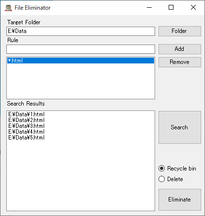

# FileEliminator

This tool deletes files according to the rules you specify.



## Usage

1. Please click "Folder" button, and set target folder containing unnecessary files.
1. Please input rule to "Rule" editbox, and Click "Add" button.
1. Please select unnecessary rule, and Click "Remove" button to delete rule.
1. To display all files in "Search Result" listbox, please click "Search" button.
1. Please confirm "Search Result" listbox.
1. Put a check "Recycle bin" or "Delete", and click "Eliminate" button.
1. All files deleted or move to recycle bin!

## Rules

You can use wildcard(*).
```
*.*    // collect all files
*.txt  // collect text files
*test* // collect files contain word "test" in file name
```

## Special Thanks

- [INIFileParserDotNetCore ](https://www.nuget.org/packages/INIFileParserDotNetCore/)
- [FLAT ICON DESIGN](http://flat-icon-design.com/) - very very  cute icons!